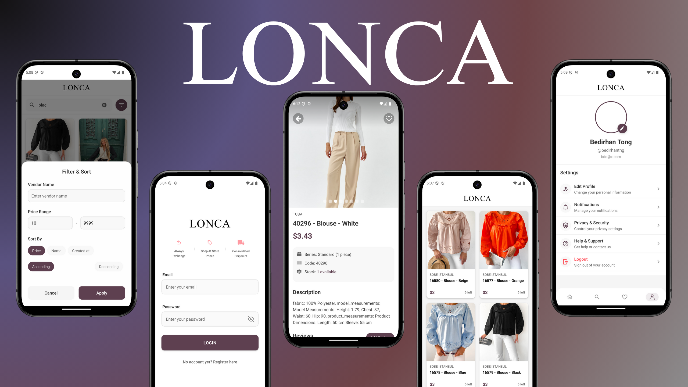

# Lonca App

Lonca App, modern bir e-ticaret platformu olup, React Native tabanlı mobil uygulama ve Node.js tabanlı RESTful API'den oluşmaktadır.

## 📱 Mobil Uygulama (Client)

### Özellikler
- Ürün listeleme ve detaylı görüntüleme
- Gelişmiş arama ve filtreleme sistemi
- Favori ürün yönetimi
- Kullanıcı değerlendirmeleri ve puanlamaları
- Responsive ve animasyonlu kullanıcı arayüzü
- iOS & Android platform desteği

### Teknolojiler
- React Native (0.76.7)
- Expo (52.0.41)
- TypeScript
- Redux Toolkit (State yönetimi)
- Expo Router (Navigasyon)
- Axios (API iletişimi)

### Ekran Görüntüleri
Uygulama içi ekran görüntülerine `client/lonca-shopping-case/README.md` dosyasından ulaşabilirsiniz.

## 🖥 Backend API (Server)

### Özellikler
- JWT tabanlı kimlik doğrulama
- RESTful API endpoints
- Ürün yönetimi ve arama
- Kullanıcı profil yönetimi
- Favori ürün sistemi
- Swagger UI ile API dokümantasyonu

### API Özellikleri
- Kullanıcı kaydı ve girişi
- Ürün listeleme ve arama
- Favori ürün ekleme/çıkarma
- Kullanıcı profil yönetimi
- Sayfalama ve filtreleme desteği

### Teknolojiler
- Node.js
- Express.js
- JWT Authentication
- Swagger UI
- Supabase (Veritabanı ve Authentication servisleri)

## 🚀 Başlangıç

### Backend Kurulum
```bash
cd server
npm install
npm run dev
```

API dokümantasyonuna `http://localhost:3000/api-docs` adresinden erişebilirsiniz.

### Mobil Uygulama Kurulum
```bash
cd client/lonca-shopping-case
npm install
npm run ios     # iOS için
npm run android # Android için
```

## 🏗 Proje Yapısı

```
lonca-app/
├── client/                 # Mobil uygulama
│   └── lonca-shopping-case/
│       ├── app/
│       ├── features/
│       └── components/
└── server/                 # Backend API
    ├── src/
    ├── routes/
    └── controllers/
```

## 📚 Dokümantasyon

Detaylı dokümantasyon için:
- Backend API: `server/README.md`
- Mobil Uygulama: `client/lonca-shopping-case/README.md`
